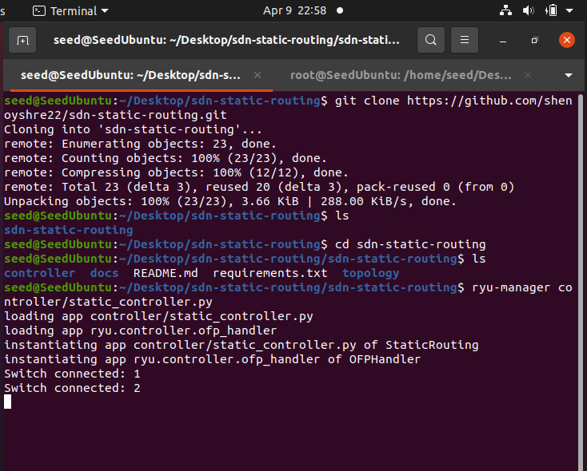
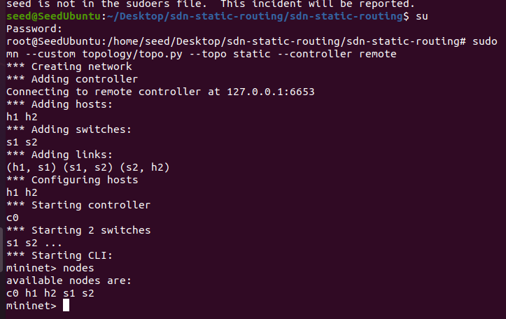
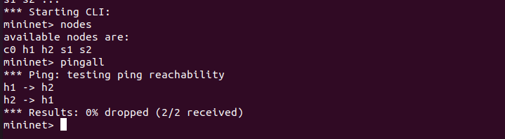
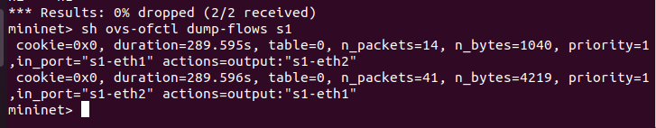
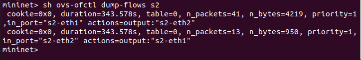
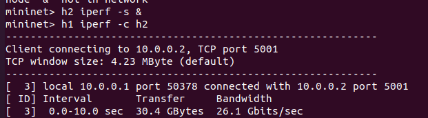

# SDN Static Routing using Ryu Controller

**Name:** Shreya Shenoy  
**SRN:** PES2UG24CS487  
**Subject:** CN ORANGE PROBLEM  
**Question:** 4  

---

## Problem Statement
Implement static routing using SDN controller by installing flow rules manually.

---

## Setup
sudo apt install mininet  
pip3 install ryu  

---

## Run
ryu-manager controller/static_controller.py  

sudo mn --custom topology/topo.py --topo static --controller remote  

---

## Expected Output
- Hosts can ping each other  
- Flow rules installed in switches  
- Static path followed  

---

## Testing
- pingall → checks connectivity between hosts  
- iperf → measures throughput  
- flow table inspection → verifies match-action rules  

---

## Results

### 1. Controller Initialization & Switch Connection

When the Ryu controller is started, it waits for switches to connect. Once Mininet is launched, switches establish a connection with the controller. This confirms proper interaction between the **control plane (controller)** and **data plane (switches)**.

---

### 2. Topology Verification

The `nodes` command in Mininet shows all devices in the network.  
Here, we observe:
- 2 hosts → h1, h2  
- 2 switches → s1, s2  

This confirms that the intended topology has been created correctly.

---

### 3. Connectivity Test (Ping)

The `pingall` command checks connectivity between all hosts in the network.  
The result shows **0% packet loss**, meaning:
- packets are successfully forwarded  
- routing path is correctly implemented  

This validates that the static flow rules are working as expected.

---

### 4. Flow Table Inspection (Core of Static Routing)

Flow tables define how packets are handled by switches. These rules are installed by the controller.

#### Switch s1:
- Packets entering from host (in_port=1) are forwarded to switch s2 (port 2)  
- Packets coming back are sent to host h1  

#### Switch s2:
- Packets from s1 are forwarded to host h2  
- Reverse traffic is sent back to s1  

These entries clearly demonstrate **match-action rules**, where:
- match → input port  
- action → output port  

This confirms that routing is **static**, not dynamically learned.

---

### 5. Performance Testing (iperf)

The `iperf` tool is used to measure throughput between hosts.  
The output shows successful connection and data transfer between h1 and h2.

This proves that:
- network is not only connected  
- but also capable of handling data transfer efficiently  

---

## Explanation

- SDN separates control and data planes  
- The controller installs flow rules in switches  
- Switches follow these rules instead of making independent decisions  
- No routing protocol is used → all paths are predefined  
- This is called **static routing using SDN**

---

## Conclusion

- Static routing successfully implemented using Ryu controller  
- Flow rules correctly define packet forwarding paths  
- Network connectivity verified using ping  
- Flow tables confirm controller-based routing  
- Performance validated using iperf  

---

## Results Folder
Screenshots are also available in the `results` folder for reference.